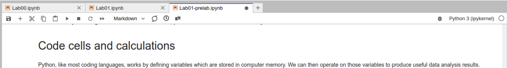
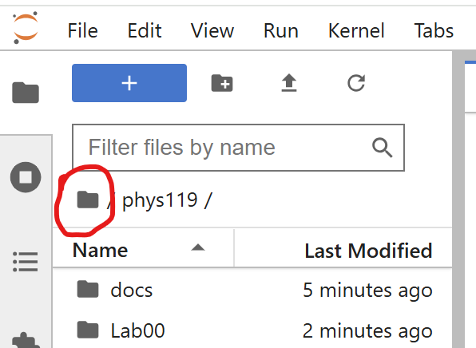

# Troubleshooting Jupyter Notebook Technical Problems

There are a few problems we see occasionally in using Jupyter Notebooks on our Physics 119 Jupyter server. There are some suggestions below for how to resolve problems you might see. If you can't get past a problem with the steps below, ask us - in person, in office hours, or
on Piazza!

The vast majority of problems with things inside the notebook not executing properly can be resolved by either simply reloading the browser tab or by closing the browser tab that you are using, and logging in to https://phys119.phas.ubc.ca/ again.

## 1) Problem: I can see my Jupyter notebook, but whenever I try to execute python code cells, they don’t work.

Suggestions: The first thing to check is to see if the python kernel has died or timed out.
In the upper right of the window, there should be an open circle. When you hover the mouse over the circle it should say ‘Kernel status: Idle’

If instead the circle looks like a lightning bolt, and says something like ‘Disconnected’ or ‘Connecting’ or anything other than idle when you hover over it, it is probably not working. Another symptom is that when you try to execute a cell, you see a * show up in the [ ]’s at the left of the cell. When things are working, a * will appear briefly, but quickly turn into a number, like: [5]. To resolve this issue:
Try just reloading the page (CTRL-R in many browsers)
Try logging in again at https://open.jupyter.ubc.ca 
	You will need to execute all the cells in the notebook again after doing this.
Or:

Ensure your work is saved (CTRL-S or File->Save Notebook or use the disk icon on the upper left).
Close the notebook file (the x mark next to the name of notebook you are working in - here its Lab01-prelab.ipynb)
File->Hub Control Panel
Stop my server
Wait till it’s stopped
Start Server
In the file browser on the left, navigate to the file you were working in.

If this doesn’t work, there are a couple of other things you can try:

1. Select Kernel->Restart Kernel and try again.
1. log in again in a private browsing window

## 2) Problem: import data_entry2 fails.

Suggestion: A cell near the end of Lab 00 installs the modules needed for our data entry module to work. Before these installed modules will
function properly, the Jupyter server environment needs to be restarted. If you've never successfully used the data_entry2 module try navigating to:

> File -> Hub Control Panel -> Stop My Server

wait a minute or two, then Restart the server (then close the old
tabs). Try again, importing data_entry2 should work properly from now on.

If you didn't complete the installation step in Lab 00, do that before restarting the server. 

## 3) Problem: Logging in fails - nothing ever happens after submitting CWL and password.

Suggestions: try another browser or a private browsing window. If those behave the same way, then there is probably a bigger issue. Check with others (eg on piazza or at your lab table)
to see if they are having the same problem. If so, there's probably not much you can do to fix it beyond letting us know there is a problem.

## 4) Problem: Can't even get to logging in at https://open.jupter.ubc.ca

Suggestions: Try logging in from a private browsing window. If it works, you can try deleting cookies from ubc.ca and then it should work without needing private browsing.

## 5) Problem: I deleted a cell with some instructions from a notebook template

Suggestions: To get a fresh copy of the notebook you are working on, you can rename the notebook you are working on (e.g., from Prelab02.ipynb to Prelab02_old.ipynb) and then click on the notebook link again (from the homepage of Canvas) and you will get a brand new copy of the file. You can restart your work in this new copy of the notebook or copy any content from it into your old notebook.

## 6) Problem: When I click on a cell to edit it or execute it, the content disappears!

Suggestions: We’ve seen this a few times, seems to happen on Macs, in Safari. Try switching browsers to Chrome or Firefox.

## 7) Problem: My spreadsheet disappeared or was corrupted somehow!

Suggestions: One way to “lose” spreadsheet data is if you reuse the same spreadsheet name for multiple sheets in your notebook. If you give a second sheet the same file name as the first sheet, anything you change in the second sheet will overwrite the data in the first sheet - that’s not what we want! Even if you’ve done this though, all is not necessarily lost.

Every time you Generate Vectors with an updated spreadsheet, a backup copy of your most recent spreadsheet is created in the csv_backups folder that you should be able to see alongside your notebook. You can navigate into that folder to look for previous versions. If you find a version that contains data you want to restore: 1) make a copy of the spreadsheet from the csv_backups 2) rename the copy to something sensible, like: restored_sheet1.csv, 3) move that file up into the folder where the notebook is by dragging it with the mouse to the list of folder names. 4) In your notebook, change the code cell to:

> de_restore1 = data_entry2.sheet('restored_sheet1.csv')

## 8) Problem: Internal Server Error when trying to export as html

Suggestion: One way this can happen is if any of the cells in your notebook are of type “Raw” rather than Code or Markdown. Click through all your notebook cells and see if there are any marked as Raw, and if so, change them.

## 9) Including images (jpeg, png etc) in your html exported notebooks.

You can include images in your markdown, but you need to do it the right way if those images are to be embedded in the html export of your notebook. You may be able to drag and drop images into a markdown cell, but what seems to work most consistently is to copy and paste an image file into a markdown cell that you are editing. This will embed the image so that it is within the notebook itself, and will be exported when the notebook is exported. Copy the image with CTRL-C (or Command-C) from your file browser, and then type CTRL-V (or Command-V) in the place in your markdown code where you’d like the image to appear.

## 10) A link to a Jupyter document is not working and Jupyter won't load; you get the error "returned non-zero exit status 128"

If you get something similar to the following when trying to login to Jupyter using a Jupyter document link: 

> $ git fetch
> $ git reset --mixed
> $ git -c user.email=nbgitpuller@nbgitpuller.link -c user.name=nbgitpuller merge -Xours origin/main
> fatal: refusing to merge unrelated histories
> Traceback (most recent call last):
> File "/opt/tljh/user/lib/python3.10/threading.py", line 1016, in _bootstrap_inner
>    self.run()
> File "/opt/tljh/user/lib/python3.10/threading.py", line 953, in run
>    self._target(*self._args, **self._kwargs)
> File "/opt/tljh/user/lib/python3.10/site-packages/nbgitpuller/handlers.py", line 93, in pull
>    raise e
> File "/opt/tljh/user/lib/python3.10/site-packages/nbgitpuller/handlers.py", line 87, in pull
>    for line in gp.pull():
> File "/opt/tljh/user/lib/python3.10/site-packages/nbgitpuller/pull.py", line 144, in pull
>    yield from self.update()
> File "/opt/tljh/user/lib/python3.10/site-packages/nbgitpuller/pull.py", line 344, in update
>    yield from self.merge()
> File "/opt/tljh/user/lib/python3.10/site-packages/nbgitpuller/pull.py", line 273, in merge
>    for line in execute_cmd([
> File "/opt/tljh/user/lib/python3.10/site-packages/nbgitpuller/pull.py", line 48, in execute_cmd
>     raise subprocess.CalledProcessError(ret, cmd)
> subprocess.CalledProcessError: Command '['git', '-c', 'user.email=nbgitpuller@nbgitpuller.link', '-c', 'user.name=nbgitpuller', 'merge', '-Xours', 'origin/main']' returned non-zero exit status 128.

Log directly into https://phys119.phas.ubc.ca/. 

 - Click on the folder icon directly under "Filter Files by Name" near the top left in "📁 / phys119 /"

- Right-click on the folder "phys119" below and choose Rename
- Rename to "old_phys119"
- Try clicking on the original document link and you will get a fresh version of ALL course documents. If you need access to any of your old documents, you can always revisit your "old_phys119" version of the course on the server
